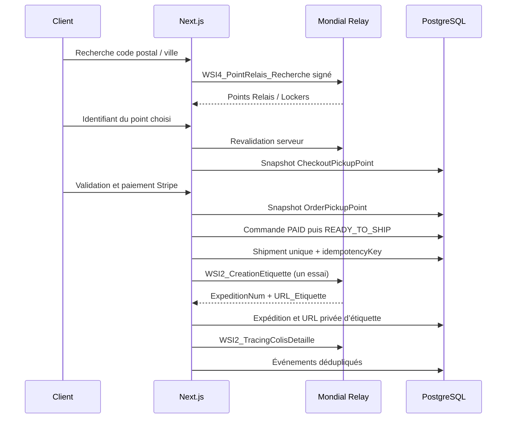

# Intégration Mondial Relay

L’intégration étend le checkout, les commandes et les expéditions existants. Elle utilise les Web Services SOAP publiés par Mondial Relay :

- `WSI4_PointRelais_Recherche` pour rechercher et revalider un point ;
- `WSI2_CreationEtiquette` pour créer une expédition et obtenir son étiquette ;
- `WSI2_TracingColisDetaille` pour lire le suivi détaillé.

Références officielles :

- https://api.mondialrelay.com/web_services.asmx
- https://api.mondialrelay.com/web_services.asmx?op=WSI4_PointRelais_Recherche
- https://api.mondialrelay.com/web_services.asmx?op=WSI2_CreationEtiquette
- https://api.mondialrelay.com/web_services.asmx?op=WSI2_TracingColisDetaille

## Configuration

Copier les variables `MONDIAL_RELAY_*` de `.env.example` dans `.env`. Les valeurs doivent venir du contrat marchand Mondial Relay. La clé privée reste exclusivement côté serveur. Les modes de collecte et de livraison sont des codes contractuels : l’application ne leur attribue aucune valeur implicite.

Le seed crée `MONDIAL_RELAY_PICKUP` avec `isActive=false` et `price=0`. Avant de l’activer dans Prisma Studio :

1. renseigner le prix client, le seuil éventuel et les délais de la boutique ;
2. vérifier l’association au pays `FR` ;
3. renseigner toutes les variables d’environnement ;
4. passer `MONDIAL_RELAY_ENABLED=true` ;
5. passer la méthode en `isActive=true`.

Le prix affiché provient uniquement de `ShippingMethod`. Aucun tarif n’est extrait du site du transporteur.

## Flux



## Signature et fiabilité

Les valeurs sont concaténées dans l’ordre exact du contrat SOAP, sans séparateur, puis la clé privée est ajoutée. Le MD5 UTF-8 du résultat est envoyé en hexadécimal majuscule. MD5 n’est utilisé que pour ce protocole historique. La clé n’est jamais journalisée.

- SOAP est appelé côté serveur, avec un délai maximal de 8 secondes.
- Les lectures ont au plus deux tentatives. La création n’est jamais relancée automatiquement.
- Une réponse ambiguë place le brouillon en `CREATE_UNKNOWN` et bloque un second colis.
- `Shipment.idempotencyKey` et `providerShipmentId` sont uniques.
- L’étiquette passe par une route administrateur qui vérifie la session et l’hôte.
- Les événements sont dédupliqués avec `(shipmentId, providerKey)`.
- Le poids est `ProductVariant.weightGrams × quantité`; un poids absent bloque l’envoi.

`WSI2_TracingColisDetaille` publie des libellés, mais pas une grille stable de codes métier dans son contrat public. L’application conserve donc le libellé officiel et ne devine pas un statut livré. `DELIVERED` reste explicite tant qu’une grille contractuelle officielle n’est pas disponible.

## Recette

```bash
npx prisma generate
npx prisma migrate deploy
npm run db:seed
npm run test:shipping
npm run lint
npm run build
```

Sans identifiants contractuels, les tests locaux couvrent la signature, le parsing SOAP, l’absence de clé privée en clair et les erreurs de configuration. La recette réseau nécessite des identifiants de test valides et une commande payée avec des poids réels.
